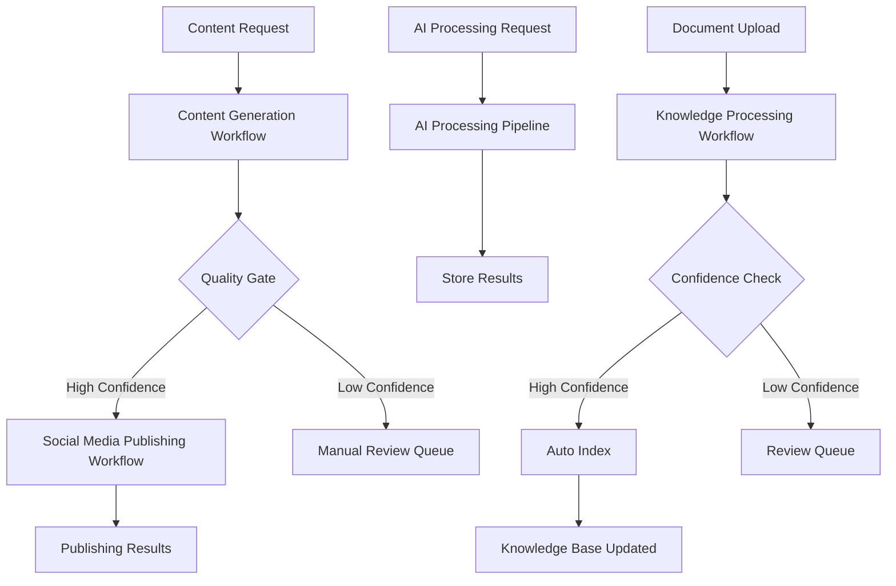

# PAKE System - n8n Automation Workflows

This directory contains the complete n8n automation workflow implementations for the PAKE System Phase 2 AI Framework.

## 🚀 Overview

The PAKE System n8n automation workflows provide enterprise-grade automation for content generation, social media publishing, AI processing, and knowledge management. These workflows are designed to work together as an integrated automation ecosystem.

## 📁 Workflow Files

### Core Workflows

1. **`content_generation_workflow.json`** - Automated content generation using OpenAI GPT-4
2. **`social_media_publishing_workflow.json`** - Multi-platform social media publishing automation
3. **`ai_processing_pipeline_workflow.json`** - Unified AI processing pipeline for multiple AI providers
4. **`knowledge_management_workflow.json`** - Automated knowledge processing and indexing

### Integration Tools

5. **`n8n_workflow_manager.py`** - Python interface for triggering and managing workflows

## 🔧 Setup Instructions

### 1. Prerequisites

Ensure n8n is running and accessible:

```bash
# From the PAKE_SYSTEM root directory
cd docker
docker-compose up -d postgres redis n8n
```

Access n8n web interface at: http://localhost:5678

- Username: `admin`
- Password: `process.env.N8N_PASSWORD || 'SECURE_PASSWORD_REQUIRED'`

### 2. Import Workflows

1. Open n8n web interface (http://localhost:5678)
2. Click "Import from file" or use the "+" button
3. Import each workflow JSON file:
   - `content_generation_workflow.json`
   - `social_media_publishing_workflow.json`
   - `ai_processing_pipeline_workflow.json`
   - `knowledge_management_workflow.json`

### 3. Configure Environment Variables

Ensure these environment variables are set in your `.env` file:

```bash
# OpenAI Configuration
OPENAI_API_KEY=your_openai_api_key_here

# Social Media API Keys
TWITTER_API_KEY=your_twitter_api_key_here
LINKEDIN_API_KEY=your_linkedin_api_key_here
FACEBOOK_API_KEY=your_facebook_api_key_here
LINKEDIN_COMPANY_ID=your_linkedin_company_id

# Vapi.ai Configuration
VAPI_API_KEY=your_vapi_api_key_here
VAPI_API_ENDPOINT=https://api.vapi.ai

# D-ID Configuration
DID_API_KEY=your_did_api_key_here

# n8n Configuration
N8N_BASE_URL=http://localhost:5678
N8N_USER=admin
N8N_PASSWORD=process.env.N8N_PASSWORD || 'SECURE_PASSWORD_REQUIRED'
```

### 4. Activate Workflows

In the n8n interface:

1. Open each imported workflow
2. Click the "Active" toggle to enable the workflow
3. Verify the webhook URLs are accessible

## 🎯 Workflow Usage

### Content Generation Workflow

**Webhook URL:** `http://localhost:5678/webhook/trigger-content-generation`

**Example Request:**

```json
{
  "topic": "The Future of AI in Enterprise Automation",
  "contentType": "blog_post",
  "targetAudience": "technology professionals",
  "tone": "professional",
  "keywords": ["AI", "automation", "enterprise", "efficiency"]
}
```

**Response:**

```json
{
  "status": "success",
  "content_id": "content_1693532400_abc123",
  "confidence_score": "0.92",
  "next_action": "auto_publish",
  "word_count": 1247,
  "estimated_reading_time": "6 minutes"
}
```

### Social Media Publishing Workflow

**Webhook URL:** `http://localhost:5678/webhook/trigger-social-media-publishing`

**Example Request:**

```json
{
  "content_id": "content_1693532400_abc123",
  "content": "Exciting news! Our AI automation platform just reached a new milestone...",
  "platforms": ["twitter", "linkedin", "facebook"],
  "auto_publish": true
}
```

### AI Processing Pipeline Workflow

**Webhook URL:** `http://localhost:5678/webhook/trigger-ai-processing`

**Example Request:**

```json
{
  "processing_type": "text_analysis",
  "input_data": "Analyze the sentiment of this customer review...",
  "priority": "high",
  "callback_url": "http://localhost:8000/api/ai-results/callback"
}
```

### Knowledge Processing Workflow

**Webhook URL:** `http://localhost:5678/webhook/trigger-knowledge-processing`

**Example Request:**

```json
{
  "document_type": "pdf",
  "source": "/path/to/document.pdf",
  "metadata": {
    "title": "AI Research Paper",
    "author": "Research Team",
    "tags": ["AI", "research", "machine-learning"]
  },
  "auto_index": true,
  "confidence_threshold": 0.8
}
```

## 🐍 Python Integration

Use the `n8n_workflow_manager.py` for programmatic workflow execution:

```python
from n8n_workflow_manager import N8nWorkflowManager
import asyncio

async def example():
    manager = N8nWorkflowManager()

    # Generate content
    result = await manager.trigger_content_generation(
        topic="AI Innovation in Healthcare",
        content_type="blog_post",
        target_audience="healthcare professionals",
        keywords=["AI", "healthcare", "innovation"]
    )

    print(f"Status: {result.status}")
    if result.result:
        print(f"Content ID: {result.result['content_id']}")

# Run the example
asyncio.run(example())
```

## 🔗 Workflow Integration Flow

The workflows are designed to work together in an integrated pipeline:



## 📊 Monitoring and Analytics

### Workflow Execution Tracking

Each workflow provides detailed execution metrics:

- Processing time
- Confidence scores
- Quality assessments
- Cost tracking
- Error handling

### Performance Metrics

Monitor these key performance indicators:

- **Content Generation:** Average response time, quality scores, approval rates
- **Social Media Publishing:** Success rates per platform, engagement metrics
- **AI Processing:** Processing latency, cost per request, accuracy scores
- **Knowledge Management:** Indexing success rates, confidence distributions

## 🛠️ Customization

### Modifying Workflows

1. Export workflow from n8n interface
2. Edit the JSON configuration
3. Modify processing logic in function nodes
4. Update API endpoints and credentials
5. Re-import the modified workflow

### Adding New Workflows

1. Create workflow JSON following existing patterns
2. Add webhook endpoint mapping
3. Update `n8n_workflow_manager.py` with new methods
4. Document usage examples

## 🔒 Security Considerations

- All API keys are stored as environment variables
- Webhook endpoints use authentication where possible
- Sensitive data is not logged in workflow outputs
- Regular security audits of API credentials

## 🐛 Troubleshooting

### Common Issues

1. **Workflow Not Triggering**
   - Check if workflow is activated
   - Verify webhook URL accessibility
   - Check n8n service status

2. **API Authentication Errors**
   - Verify API keys in environment variables
   - Check API key permissions and quotas
   - Test API connectivity outside n8n

3. **Timeout Issues**
   - Increase timeout values in HTTP request nodes
   - Check external service response times
   - Implement retry logic for unreliable services

### Debug Mode

Enable detailed logging in n8n:

1. Go to Settings → Log Level
2. Set to "debug" for detailed execution logs
3. Check workflow execution history for errors

## 📈 Future Enhancements

Planned improvements for the automation workflows:

- Advanced content personalization
- Multi-language support
- Enhanced AI model routing
- Real-time collaboration features
- Advanced analytics dashboard
- Voice and video content automation
- Integration with more social platforms

## 📞 Support

For workflow-related issues:

1. Check n8n execution logs
2. Review webhook response codes
3. Validate environment configuration
4. Test individual workflow nodes
5. Contact the development team for complex issues

---

**Created:** August 30, 2024  
**Version:** 1.0.0  
**Status:** Production Ready ✅
